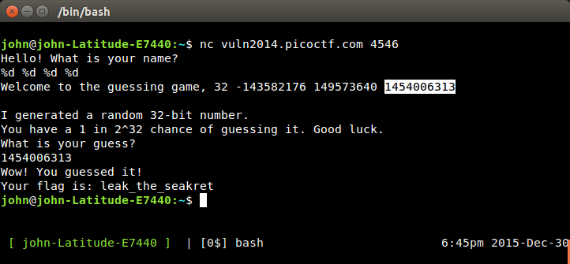

__Guess__
================

_John Hammond_ | _Wednesday, December 30th, 2015_ 


> This program requires you to guess a random 32-bit number! Sounds difficult, right? There is a server running at vuln2014.picoctf.com:4546, and the source can be found here. 


----------

You can [`netcat`][netcat] into the server to play with the service... but let's check out our [source code](guess.c)

``` c
#include <stdio.h>
#include <stdlib.h>

char *flag = "~~FLAG~~";

void main(){
    int secret, guess;
    char name[32];
    long seed;

    FILE *f = fopen("/dev/urandom", "rb");
    fread(&secret, sizeof(int), 1, f);
    fclose(f);

    printf("Hello! What is your name?\n");
    fgets(name, sizeof(name), stdin);

    printf("Welcome to the guessing game, ");
    printf(name);
    printf("\nI generated a random 32-bit number.\nYou have a 1 in 2^32 chance of guessing it. Good luck.\n");

    printf("What is your guess?\n");
    scanf("%d", &guess);

    if(guess == secret){
        printf("Wow! You guessed it!\n");
        printf("Your flag is: %s\n", flag);
    }else{
        printf("Hah! I knew you wouldn't get it.\n");
    }
}
```

Ah! Anyone see our way in? 

Looks another [`printf`][printf] [format string vulnerability]! We see them call [`printf`][printf] with the `name` variable without any other arguments. We can probably do some damage with that!

Notice that we need our `guess` to be the same as the `secret` variable in order to get our flag. Looks like `secret` is read from the `/dev/urandom` file to really get a random number.

But, we can probably leak what that number will be with our [format string vulnerability]!

We know that with the [`printf`][printf] [format specifiers], we can see data on [the stack] as an integer. So let's try and get that random number.

``` bash
$ nc vuln2014.picoctf.com 4546
Hello! What is your name?
%d
Welcome to the guessing game, 32

```

I entered that `%d` [format specifier] to read an integer off [the stack], and I get this number `32`... hmm! That's the same size as the buffer! So that must be where we are in [the stack]'s local variables. We can get other variables by kind of working backwards. If you read through the [source](guess.c), you can see the variables are initialized like this:

``` c
int secret, guess;
char name[32];
```

So let's read backwards with that data. `32` is the data that we are currently at (1), and next should be `name` (2), and then our `guess` (3), and then the `secret` variable (4)! 

That means... our random number has to be the integer `4` places in. Let's try it...



I passed in 4 `%d`s this time, and used the last number we received as our guess. Boom! Got the flag!

__Submit: `leak_the_seakret`__

[netcat]: https://en.wikipedia.org/wiki/Netcat
[Wikipedia]: https://www.wikipedia.org/
[Linux]: https://www.linux.com/
[man page]: https://en.wikipedia.org/wiki/Man_page
[PuTTY]: http://www.putty.org/
[ssh]: https://en.wikipedia.org/wiki/Secure_Shell
[Windows]: http://www.microsoft.com/en-us/windows
[virtual machine]: https://en.wikipedia.org/wiki/Virtual_machine
[operating system]:https://en.wikipedia.org/wiki/Operating_system
[OS]: https://en.wikipedia.org/wiki/Operating_system
[VMWare]: http://www.vmware.com/
[VirtualBox]: https://www.virtualbox.org/
[hostname]: https://en.wikipedia.org/wiki/Hostname
[port number]: https://en.wikipedia.org/wiki/Port_%28computer_networking%29
[distribution]:https://en.wikipedia.org/wiki/Linux_distribution
[Ubuntu]: http://www.ubuntu.com/
[ISO]: https://en.wikipedia.org/wiki/ISO_image
[standard streams]: https://en.wikipedia.org/wiki/Standard_streams
[standard output]: https://en.wikipedia.org/wiki/Standard_streams
[standard input]: https://en.wikipedia.org/wiki/Standard_streams
[read]: http://ss64.com/bash/read.html
[variable]: https://en.wikipedia.org/wiki/Variable_%28computer_science%29
[command substitution]: http://www.tldp.org/LDP/abs/html/commandsub.html
[permissions]: https://en.wikipedia.org/wiki/File_system_permissions
[redirection]: http://www.tldp.org/LDP/abs/html/io-redirection.html
[pipe]: http://www.tldp.org/LDP/abs/html/io-redirection.html
[piping]: http://www.tldp.org/LDP/abs/html/io-redirection.html
[tmp]: http://www.tldp.org/LDP/Linux-Filesystem-Hierarchy/html/tmp.html
[curl]: http://curl.haxx.se/
[cl1p.net]: https://cl1p.net/
[request]: http://www.w3.org/Protocols/rfc2616/rfc2616-sec5.html
[POST request]: https://en.wikipedia.org/wiki/POST_%28HTTP%29
[Python]: http://python.org/
[interpreter]: https://en.wikipedia.org/wiki/List_of_command-line_interpreters
[requests]: http://docs.python-requests.org/en/latest/
[urllib]: https://docs.python.org/2/library/urllib.html
[file handling with Python]: https://docs.python.org/2/tutorial/inputoutput.html#reading-and-writing-files
[bash]: https://www.gnu.org/software/bash/
[Assembly]: https://en.wikipedia.org/wiki/Assembly_language
[the stack]:  https://en.wikipedia.org/wiki/Stack_%28abstract_data_type%29
[register]: http://www.tutorialspoint.com/assembly_programming/assembly_registers.htm
[hex]: https://en.wikipedia.org/wiki/Hexadecimal
[hexadecimal]: https://en.wikipedia.org/wiki/Hexadecimal
[archive file]: https://en.wikipedia.org/wiki/Archive_file
[zip file]: https://en.wikipedia.org/wiki/Zip_%28file_format%29
[gigabytes]: https://en.wikipedia.org/wiki/Gigabyte
[GB]: https://en.wikipedia.org/wiki/Gigabyte
[GUI]: https://en.wikipedia.org/wiki/Graphical_user_interface
[Wireshark]: https://www.wireshark.org/
[FTP]: https://en.wikipedia.org/wiki/File_Transfer_Protocol
[client and server]: https://simple.wikipedia.org/wiki/Client-server
[RETR]: http://cr.yp.to/ftp/retr.html
[FTP server]: https://help.ubuntu.com/lts/serverguide/ftp-server.html
[SFTP]: https://en.wikipedia.org/wiki/SSH_File_Transfer_Protocol
[SSL]: https://en.wikipedia.org/wiki/Transport_Layer_Security
[encryption]: https://en.wikipedia.org/wiki/Encryption
[HTML]: https://en.wikipedia.org/wiki/HTML
[Flask]: http://flask.pocoo.org/
[SQL]: https://en.wikipedia.org/wiki/SQL
[and]: https://en.wikipedia.org/wiki/Logical_conjunction
[Cyberstakes]: https://cyberstakesonline.com/
[cat]: https://en.wikipedia.org/wiki/Cat_%28Unix%29
[symbolic link]: https://en.wikipedia.org/wiki/Symbolic_link
[ln]: https://en.wikipedia.org/wiki/Ln_%28Unix%29
[absolute path]: https://en.wikipedia.org/wiki/Path_%28computing%29
[CTF]: https://en.wikipedia.org/wiki/Capture_the_flag#Computer_security
[Cyberstakes]: https://cyberstakesonline.com/
[OverTheWire]: http://overthewire.org/
[Leviathan]: http://overthewire.org/wargames/leviathan/
[ls]: https://en.wikipedia.org/wiki/Ls
[grep]: https://en.wikipedia.org/wiki/Grep
[strings]: http://linux.die.net/man/1/strings
[ltrace]: http://linux.die.net/man/1/ltrace
[C]: https://en.wikipedia.org/wiki/C_%28programming_language%29
[strcmp]: http://linux.die.net/man/3/strcmp
[access]: http://pubs.opengroup.org/onlinepubs/009695399/functions/access.html
[system]: http://linux.die.net/man/3/system
[real user ID]: https://en.wikipedia.org/wiki/User_identifier
[effective user ID]: https://en.wikipedia.org/wiki/User_identifier
[brute force]: https://en.wikipedia.org/wiki/Brute-force_attack
[for loop]: https://en.wikipedia.org/wiki/For_loop
[bash programming]: http://tldp.org/HOWTO/Bash-Prog-Intro-HOWTO.html
[Behemoth]: http://overthewire.org/wargames/behemoth/
[command line]: https://en.wikipedia.org/wiki/Command-line_interface
[command-line]: https://en.wikipedia.org/wiki/Command-line_interface
[cli]: https://en.wikipedia.org/wiki/Command-line_interface
[PHP]: https://php.net/
[URL]: https://en.wikipedia.org/wiki/Uniform_Resource_Locator
[TamperData]: https://addons.mozilla.org/en-US/firefox/addon/tamper-data/
[Firefox]: https://www.mozilla.org/en-US/firefox/new/?product=firefox-3.6.8&os=osx%E2%8C%A9=en-US
[Caesar Cipher]: https://en.wikipedia.org/wiki/Caesar_cipher
[Google Reverse Image Search]: https://www.google.com/imghp
[PicoCTF]: https://picoctf.com/
[JavaScript]: https://www.javascript.com/
[base64]: https://en.wikipedia.org/wiki/Base64
[client-side]: https://en.wikipedia.org/wiki/Client-side_scripting
[client side]: https://en.wikipedia.org/wiki/Client-side_scripting
[javascript:alert]: http://www.w3schools.com/js/js_popup.asp
[Java]: https://www.java.com/en/
[2147483647]: https://en.wikipedia.org/wiki/2147483647_%28number%29
[XOR]: https://en.wikipedia.org/wiki/Exclusive_or
[XOR cipher]: https://en.wikipedia.org/wiki/XOR_cipher
[quipqiup.com]: http://www.quipqiup.com/
[PDF]: https://en.wikipedia.org/wiki/Portable_Document_Format
[pdfimages]: http://linux.die.net/man/1/pdfimages
[ampersand]: https://en.wikipedia.org/wiki/Ampersand
[URL encoding]: https://en.wikipedia.org/wiki/Percent-encoding
[Percent encoding]: https://en.wikipedia.org/wiki/Percent-encoding
[URL-encoding]: https://en.wikipedia.org/wiki/Percent-encoding
[Percent-encoding]: https://en.wikipedia.org/wiki/Percent-encoding
[endianness]: https://en.wikipedia.org/wiki/Endianness
[ASCII]: https://en.wikipedia.org/wiki/ASCII
[struct]: https://docs.python.org/2/library/struct.html
[pcap]: https://en.wikipedia.org/wiki/Pcap
[packet capture]: https://en.wikipedia.org/wiki/Packet_analyzer
[HTTP]: https://en.wikipedia.org/wiki/Hypertext_Transfer_Protocol
[Wireshark filters]: https://wiki.wireshark.org/DisplayFilters
[SSL]: https://en.wikipedia.org/wiki/Transport_Layer_Security
[Assembly]: https://en.wikipedia.org/wiki/Assembly_language
[Assembly Syntax]: https://en.wikipedia.org/wiki/X86_assembly_language#Syntax
[Intel Syntax]: https://en.wikipedia.org/wiki/X86_assembly_language
[Intel or AT&T]: http://www.imada.sdu.dk/Courses/DM18/Litteratur/IntelnATT.htm
[AT&T syntax]: https://en.wikibooks.org/wiki/X86_Assembly/GAS_Syntax
[GET request]: https://en.wikipedia.org/wiki/Hypertext_Transfer_Protocol#Request_methods
[GET requests]: https://en.wikipedia.org/wiki/Hypertext_Transfer_Protocol#Request_methods
[IP Address]: https://en.wikipedia.org/wiki/IP_address
[MAC Address]: https://en.wikipedia.org/wiki/MAC_address
[session]: https://en.wikipedia.org/wiki/Session_%28computer_science%29
[Cookie Manager+]: https://addons.mozilla.org/en-US/firefox/addon/cookies-manager-plus/
[hexedit]: http://rigaux.org/hexedit.html
[Google]: http://google.com/
[Scapy]: http://www.secdev.org/projects/scapy/
[ARP]: https://en.wikipedia.org/wiki/Address_Resolution_Protocol
[UDP]: https://en.wikipedia.org/wiki/User_Datagram_Protocol
[SQL injection]: https://en.wikipedia.org/wiki/SQL_injection
[sqlmap]: http://sqlmap.org/
[sqlite]: https://www.sqlite.org/
[MD5]: https://en.wikipedia.org/wiki/MD5
[OpenSSL]: https://www.openssl.org/
[Burpsuite]:https://portswigger.net/burp/
[Burpsuite.jar]:https://portswigger.net/burp/
[Burp]:https://portswigger.net/burp/
[NULL character]: https://en.wikipedia.org/wiki/Null_character
[Format String Vulnerability]: http://www.cis.syr.edu/~wedu/Teaching/cis643/LectureNotes_New/Format_String.pdf
[printf]: http://pubs.opengroup.org/onlinepubs/009695399/functions/fprintf.html
[argument]: https://en.wikipedia.org/wiki/Parameter_%28computer_programming%29
[arguments]: https://en.wikipedia.org/wiki/Parameter_%28computer_programming%29
[parameter]: https://en.wikipedia.org/wiki/Parameter_%28computer_programming%29
[parameters]: https://en.wikipedia.org/wiki/Parameter_%28computer_programming%29
[Vortex]: http://overthewire.org/wargames/vortex/
[socket]: https://docs.python.org/2/library/socket.html
[file descriptor]: https://en.wikipedia.org/wiki/File_descriptor
[file descriptors]: https://en.wikipedia.org/wiki/File_descriptor
[Forth]: https://en.wikipedia.org/wiki/Forth_%28programming_language%29
[github]: https://github.com/
[buffer overflow]: https://en.wikipedia.org/wiki/Buffer_overflow
[try harder]: https://www.offensive-security.com/when-things-get-tough/
[segmentation fault]: https://en.wikipedia.org/wiki/Segmentation_fault
[seg fault]: https://en.wikipedia.org/wiki/Segmentation_fault
[segfault]: https://en.wikipedia.org/wiki/Segmentation_fault
[shellcode]: https://en.wikipedia.org/wiki/Shellcode
[sploit-tools]: https://github.com/SaltwaterC/sploit-tools
[Kali]: https://www.kali.org/
[Kali Linux]: https://www.kali.org/
[gdb]: https://www.gnu.org/software/gdb/
[gdb tutorial]: http://www.unknownroad.com/rtfm/gdbtut/gdbtoc.html
[payload]: https://en.wikipedia.org/wiki/Payload_%28computing%29
[peda]: https://github.com/longld/peda
[git]: https://git-scm.com/
[home directory]: https://en.wikipedia.org/wiki/Home_directory
[NOP slide]:https://en.wikipedia.org/wiki/NOP_slide
[NOP]: https://en.wikipedia.org/wiki/NOP
[examine]: https://sourceware.org/gdb/onlinedocs/gdb/Memory.html
[stack pointer]: http://stackoverflow.com/questions/1395591/what-is-exactly-the-base-pointer-and-stack-pointer-to-what-do-they-point
[little endian]: https://en.wikipedia.org/wiki/Endianness
[big endian]: https://en.wikipedia.org/wiki/Endianness
[endianness]: https://en.wikipedia.org/wiki/Endianness
[pack]: https://docs.python.org/2/library/struct.html#struct.pack
[ash]:https://en.wikipedia.org/wiki/Almquist_shell
[dash]: https://en.wikipedia.org/wiki/Almquist_shell
[shell]: https://en.wikipedia.org/wiki/Shell_%28computing%29
[pwntools]: https://github.com/Gallopsled/pwntools
[colorama]: https://pypi.python.org/pypi/colorama
[objdump]: https://en.wikipedia.org/wiki/Objdump
[UPX]: http://upx.sourceforge.net/
[64-bit]: https://en.wikipedia.org/wiki/64-bit_computing
[breakpoint]: https://en.wikipedia.org/wiki/Breakpoint
[stack frame]: http://www.cs.umd.edu/class/sum2003/cmsc311/Notes/Mips/stack.html
[format string]: http://codearcana.com/posts/2013/05/02/introduction-to-format-string-exploits.html
[format specifiers]: http://web.eecs.umich.edu/~bartlett/printf.html
[format specifier]: http://web.eecs.umich.edu/~bartlett/printf.html
[variable expansion]: https://www.gnu.org/software/bash/manual/html_node/Shell-Parameter-Expansion.html
[base pointer]: http://stackoverflow.com/questions/1395591/what-is-exactly-the-base-pointer-and-stack-pointer-to-what-do-they-point
[dmesg]: https://en.wikipedia.org/wiki/Dmesg